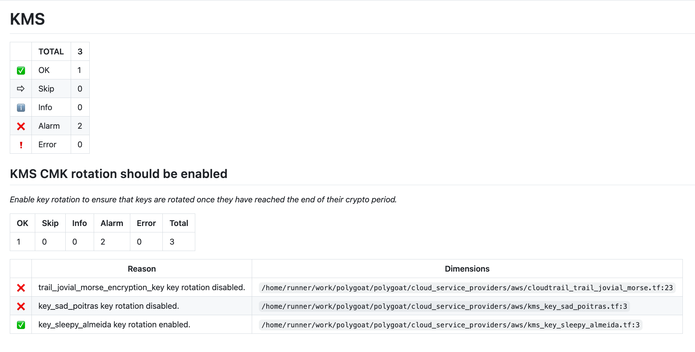
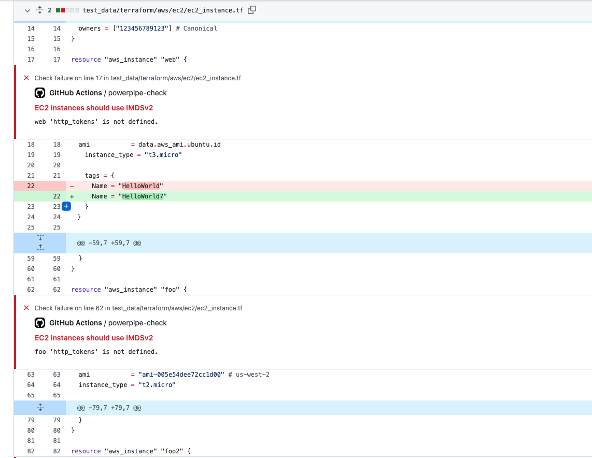

# Powerpipe Check for GitHub Actions

This action runs [Powerpipe](https://powerpipe.io/) benchmarks and controls from [Powerpipe Mods](https://hub.powerpipe.io/).



When running checks for Infrastructure as Code (IaC) mods, this action will create annotations for any controls in `alarm` state provided they have an [additional dimension](https://powerpipe.io/docs/powerpipe-hcl/control#additional-control-columns--dimensions) providing the file path and a start line number in one of the following formats: `path/filename.ext:23` or `path/name.ext:23-25`.

> Note: In order to create annotations, the workflow job requires `checks: write` and `pull-requests: write` [permissions](https://docs.github.com/en/actions/using-jobs/assigning-permissions-to-jobs).

For a list of IaC mods, please see [IaC mods](https://hub.powerpipe.io/mods?categories=iac).



## Usage

See [action.yml](action.yml).

## Examples

### Run specific controls

```yaml
  - name: Checkout repo
    uses: actions/checkout@v4

  - name: Setup/install Steampipe
    uses: turbot/steampipe-action-setup@v1
    with:
      plugin-connections: | # setup your steampipe plugin & connections
        connection "aws" {
          plugin     = "aws"
          access_key = "${{ secrets.AWS_ACCESS_KEY_ID }}"
          secret_key = "${{ secrets.AWS_SECRET_ACCESS_KEY }}"
          regions    = ["ap-south-1"]
        }

  - name: Install Powerpipe
    uses: turbot/powerpipe-action-setup@v1

  - name: Start steampipe service # start steampipe service - powerpipe will connect to this running steampipe postgres database
    run: |
      steampipe service start

  - name: Run specific AWS compliance controls
    uses: turbot/powerpipe-action-check@v1
    with:
      mod-url: https://github.com/turbot/steampipe-mod-aws-compliance
      controls: |
        ebs_volume_unused
```

### Run specific benchmarks

```yaml
  - name: Checkout repo
    uses: actions/checkout@v4

  - name: Setup/install Steampipe
    uses: turbot/steampipe-action-setup@v1
    with:
      plugin-connections: | # setup your steampipe plugin & connections
        connection "aws" {
          plugin     = "aws"
          access_key = "${{ secrets.AWS_ACCESS_KEY_ID }}"
          secret_key = "${{ secrets.AWS_SECRET_ACCESS_KEY }}"
          regions    = ["ap-south-1"]
        }

  - name: Install Powerpipe
    uses: turbot/powerpipe-action-setup@v1

  - name: Start steampipe service # start steampipe service - powerpipe will connect to this running steampipe postgres database
    run: |
      steampipe service start

  - name: Run specific AWS compliance benchmarks
    uses: turbot/powerpipe-action-check@v1
    with:
      mod-url: https://github.com/turbot/steampipe-mod-aws-compliance
      controls: |
        cis_v150
```

### Run benchmarks and controls from multiple mods

```yaml
  - name: Checkout repo
    uses: actions/checkout@v4

  - name: Setup Steampipe
    uses: turbot/steampipe-action-setup@v1
    with:
      plugin-connections: |
        connection "aws_tf" {
          plugin = "terraform"
          configuration_file_paths = [
            "cloud_infra/service_billing/aws/**/*.tf",
            "cloud_infra/service_orders/aws/**/*.tf"
          ]
        }

        connection "gcp_tf" {
          plugin = "terraform"
          configuration_file_paths = [
            "cloud_infra/service_billing/gcp/**/*.tf",
            "cloud_infra/service_orders/gcp/**/*.tf"
          ]
        }

  - name: Start steampipe service # start steampipe service - powerpipe will connect to this running steampipe postgres database
    run: |
      steampipe service start

  - name: Install Powerpipe
    uses: turbot/powerpipe-action-setup@v1

  - name: Run Terraform AWS Compliance control
    uses: turbot/powerpipe-action-check@v1
    with:
      mod-url: https://github.com/turbot/steampipe-mod-terraform-aws-compliance
      controls: |
        ec2_ebs_default_encryption_enabled
      control-additional-args: '--search-path-prefix=aws_tf'

  - name: Run GCP Terraform Compliance benchmark
    uses: turbot/powerpipe-action-check@v1
    with:
      mod-url: https://github.com/turbot/steampipe-mod-terraform-gcp-compliance
      benchmarks: |
        compute
      benchmark-additional-args: '--search-path-prefix=gcp_tf'
```

### Use a specific tag version of a mod

```yaml
  - name: Checkout repo
    uses: actions/checkout@v4

  - name: Setup Steampipe
    uses: turbot/steampipe-action-setup@v1
    with:
      plugin-connections: |
        connection "terraform" {
          plugin = "terraform"
          configuration_file_paths = [ "./**/*.tf" ]
        }

  - name: Install Powerpipe
    uses: turbot/powerpipe-action-setup@v1

  - name: Start steampipe service # start steampipe service - powerpipe will connect to this running steampipe postgres database
    run: |
      steampipe service start

  - name: Run Terraform AWS Compliance v0.18 controls
    uses: turbot/steampipe-action-check@v1
    with:
      mod-url: https://github.com/turbot/steampipe-mod-terraform-aws-compliance
      mod-branch: v0.18
      controls: |
        ec2_ebs_default_encryption_enabled
```

### Run AWS CIS v2.0.0 benchmark

This example uses an [IAM OIDC identity provider](https://aws.amazon.com/blogs/security/use-iam-roles-to-connect-github-actions-to-actions-in-aws/) with an IAM role.

> Note: In order to use OIDC the workflow job will require `id-token: write` permissions. For more information, please see [Adding permission settings](https://docs.github.com/en/actions/deployment/security-hardening-your-deployments/configuring-openid-connect-in-amazon-web-services#adding-permissions-settings).


```yaml
steps:
  - name: Checkout repo
    uses: actions/checkout@v4

  - name: Setup AWS Credentials
    uses: aws-actions/configure-aws-credentials@v4
    with:
      role-to-assume: arn:aws:iam::1234567890:role/my-role
      aws-region: us-east-1

  - name: Setup Steampipe
    uses: turbot/steampipe-action-setup@v1
    with:
      plugin-connections: |
        connection "aws" {
          plugin = "aws"
        }

  - name: Install Powerpipe
    uses: turbot/powerpipe-action-setup@v1

  - name: Start steampipe service # start steampipe service - powerpipe will connect to this running steampipe postgres database
    run: |
      steampipe service start

  - name: Run Powerpipe benchmarks
    uses: turbot/powerpipe-action-check@v1
    with:
      mod-url: https://github.com/turbot/steampipe-mod-aws-compliance
      benchmarks: |
        benchmark.cis_v200
```

### Create Turbot Pipes snapshot

The check results can also be created and uploaded as snapshots to [Turbot Pipes](https://turbot.com/pipes).

A snapshot is a saved view of benchmark and control results and may be shared with other Turbot Pipes users or with anyone that has the link.

Snapshot visibility is set by the `pipes-snapshot-visibility` input:
  - `anyone_with_link` - Snapshot is shareable with anyone.
  - `workspace` - Snapshot is created in the user's default workspace. To save the snapshot to a different location, use `--snapshot-location` in the `additional-args` input.

```yaml
  - name: Checkout repo
    uses: actions/checkout@v4

  - name: Setup AWS Credentials
    uses: aws-actions/configure-aws-credentials@v4
    with:
      role-to-assume: arn:aws:iam::1234567890:role/my-role
      aws-region: us-east-1

  - name: Setup Steampipe
    uses: turbot/steampipe-action-setup@v1
    with:
      plugin-connections: |
        connection "aws" {
          plugin = "aws"
        }

  - name: Install Powerpipe
    uses: turbot/powerpipe-action-setup@v1

  - name: Start steampipe service # start steampipe service - powerpipe will connect to this running steampipe postgres database
    run: |
      steampipe service start

  - name: Run Powerpipe benchmarks
    uses: turbot/powerpipe-action-check@v1
    with:
      mod-url: https://github.com/turbot/steampipe-mod-aws-compliance
      benchmarks: |
        benchmark.cis_v200
      pipes-snapshot-visibility: workspace
      pipes-token: ${{ secrets.PIPES_TOKEN }}
```

## Advanced Examples

### Run a control against a DuckDB Backend

Connect to a DuckDB backend and run controls.

```yaml
  - uses: actions/checkout@v4

  - name: Install Powerpipe
    uses: turbot/powerpipe-action-setup@v1

  - name: Run
    run: |
      powerpipe -v

  - name: Run Control
    uses: turbot/powerpipe-action-check@v1
    with:
      mod-url: "https://github.com/pskrbasu/powerpipe-mod-duckdb-demo"
      controls: |
        testing_control
      pipes-snapshot-visibility: 'anyone_with_link'
      pipes-token: "${{ secrets.PIPES_TOKEN }}"
      database: "duckdb:///$(pwd)/test_data/employee.duckdb"
```

### Run a control against a SQLite Backend

Connect to a SQLite backend and run controls.

```yaml
  - uses: actions/checkout@v4

  - name: Install Powerpipe
    uses: turbot/powerpipe-action-setup@v1

  - name: Run
    run: |
      powerpipe -v

  - name: Run Control
    uses: turbot/powerpipe-action-check@v1
    with:
      mod-url: "https://github.com/pskrbasu/powerpipe-mod-sqlite-demo"
      controls: |
        testing_control
      pipes-snapshot-visibility: 'anyone_with_link'
      pipes-token: "${{ secrets.PIPES_TOKEN }}"
      database: "duckdb:///$(pwd)/test_data/employee.db"
```

## Helpful links

- [Powerpipe docs](https://powerpipe.io/docs)
- [Steampipe plugins](https://hub.steampipe.io/plugins)
- [Powerpipe mods](https://hub.powerpipe.io/mods)
